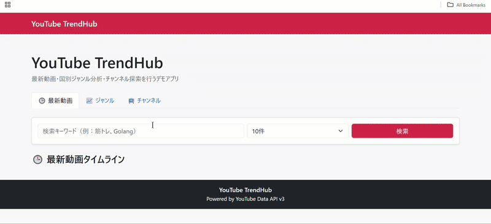
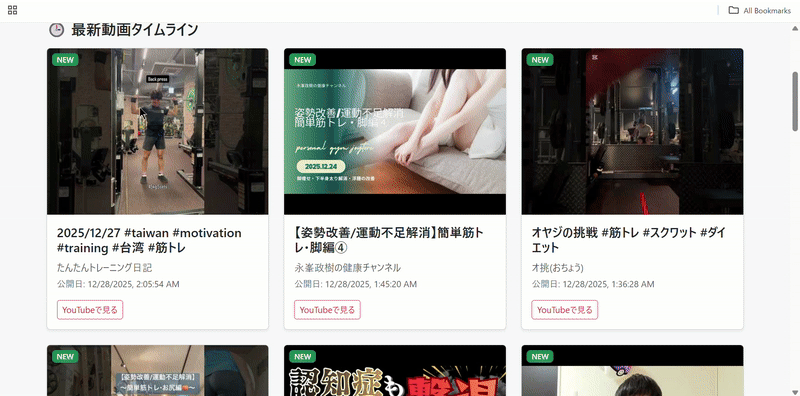
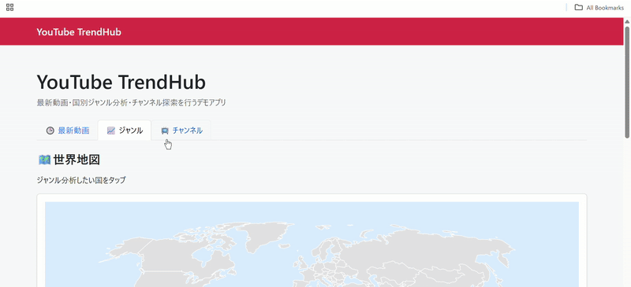
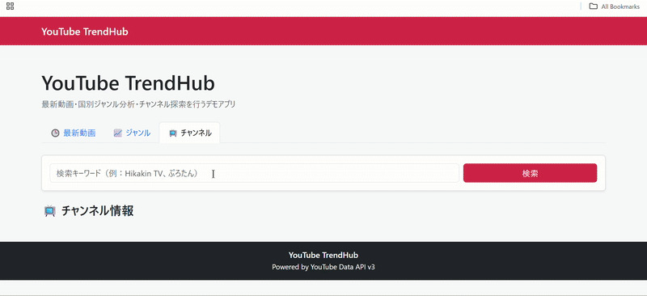
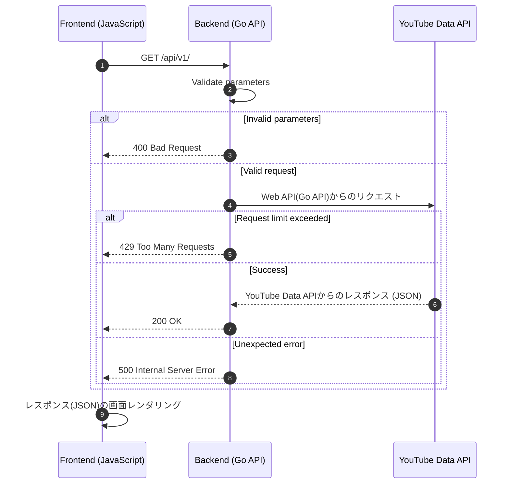

# go-lang-web-api
## 概要
本プロジェクトは、Go 言語で実装した Web API です。  
YouTube Data API v3 を利用し、チャンネル情報の取得や国別のジャンル分析などを行います。

主な機能は以下の通りです。

- 国別の人気ジャンル割合および上位動画の取得
- チャンネル名による検索と統計情報（登録者数・再生数など）の取得
- キーワード検索による最新動画一覧を取得

フロントエンドと組み合わせることで、国やチャンネルごとの
YouTube トレンドを可視化するだけでなく最新の動画を取得することを目的としています。

## デモ動画
### キーワード検索で最新動画を取得
#### 初回検索時に最新動画を取得


 
#### 一定時間経過後に再検索すると、新しく更新された動画に「NEW」ラベルを表示


 

### 国別ジャンルの割合と関連動画の取得
#### ※YouTube が利用できない国を選択した場合は、アラートを表示


### キーワード検索によるチャンネル情報の取得
#### ※検索条件が不正な場合（未入力・該当チャンネルなし）は、アラートを表示



## 通信フロー


## Go web API エンドポイント一覧
| メソッド | パス | パラメータ | 説明 |
| :--- | :--- | :--- | :--- |
| GET | /api/v1/analytics/genres | country | 国別のジャンル割合および上位動画を取得 |
| GET | /api/v1/channels | query | チャンネル統計情報を取得 |
| GET | /api/v1/videos | keyword, limit, since | 最新動画一覧を取得 |


## 環境構築方法

### 1. 必要な環境
- Go 1.24.0 以上
- YouTube Data API v3 の APIキー

### 2. リポジトリのクローン
```
git clone https://github.com/xxx/go-lang-web-api.git
cd go-lang-web-api
```

### 3. 環境変数の設定
#### .env ファイルの作成
server/.env に以下の内容でファイルを作成してください。
```
YOUTUBE_API_KEY=xxxxxxxxxxxxxxx
```
※ API_KEY には YouTube Data API v3 の APIキーを設定してください。

### 4. サーバーの起動
```
go run server/main.go
```
起動後、以下の URL にアクセスしてください。

http://localhost:8000